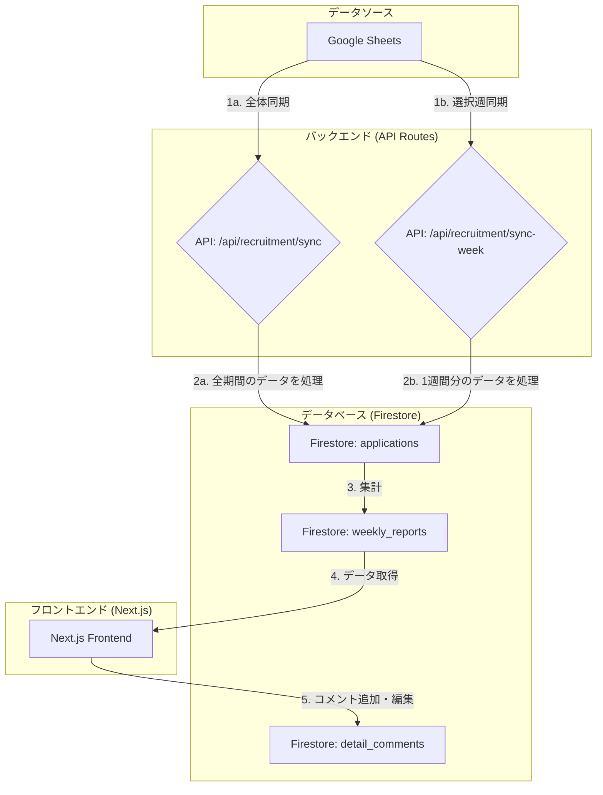

# データアーキテクチャ仕様書

## 1. 概要

本システムのデータアーキテクチャは、Google Sheetsをマスターデータソースとし、Firebase (Firestore) をアプリケーションのプライマリデータベースとして利用するサーバーレスアーキテクチャを採用する。

データの流れは、**「全体同期」**と**「選択週同期」**の2つの主要なモードを持つ。

## 2. データフロー

### 2.1. データフロー図

### 2.2. フロー詳細

#### 2.2.1. データ同期モード

本システムは、目的の異なる2つの手動同期モードを提供する。

-   **選択週同期（基本運用）:**
    -   **目的:** 日々の運用で、特定の1週間のデータを高速に更新する。
    -   **トリガー:** UI上の `[選択週を同期]` ボタン。
    -   **処理:**
        1.  指定された1週間分のデータをGoogle Sheetsから取得。
            - 採用管理シート（応募・面談・内定受諾）
            - 求人エントリーフォーム（書類提出＝タイムスタンプ）
        2.  該当する`applications`ドキュメントを更新。
            - 書類提出日はフォームのタイムスタンプで補完（名寄せは正規化氏名キー）
        3.  該当する`weekly_reports`ドキュメントを再生成。
    -   **API:** `POST /api/recruitment/sync-week`

-   **全体同期（特殊操作）:**
    -   **目的:** 過去データの大規模な修正や、システム初期化時に、全てのデータを洗い替えする。
    -   **トリガー:** UI上の `[全体��同期]` ボタン。
    -   **処理:**
        1.  **全ての**データをGoogle Sheetsから取得。
        2.  Firestoreの`applications`コレクションを洗い替え（または全件Upsert）。
        3.  Firestoreの`weekly_reports`コレクションを全期間分、再生成。
    -   **API:** `POST /api/recruitment/sync`

#### 2.2.2. フロントエンドへのデータ供給

-   Next.jsフロントエンドは、`useWeeklyReports`フックなどを介してFirestoreの`weekly_reports`コレクションからデータを取得する。
-   このフックは、UIの表示に必要な4週間分のデータを効率的に取得する。

#### 2.2.3. ユーザーによるデータ生成（コメント機能）

-   ユーザーが「主要項目詳細」を追加・編集すると、フロントエンドは直接Firestoreの`detail_comments`コレクションに書き込み・更新を行う。

## 3. 主要コンポーネントと責務

-   **Google Sheets:**
    -   **責務:** 全ての採用データのマスターソース。
-   **API Routes (`/api/recruitment/*`):**
    -   **責務:** Google Sheetsからデータを取得し、Firestoreが扱いやすい形式に変換・集計して保存するETL処理。同期モード（全体/選択週）に応じた処理を行う。
-   **Firestore:**
    -   **責務:** アプリケーションのプライマリデータベース。
    -   **`applications`:** 個別の応募者データ。
    -   **`weekly_reports`:** 集計済みの週次レポートデータ。
    -   **`detail_comments`:** ユーザーが入力したコメントデータ。
-   **Next.js Frontend:**
    -   **責務:** Firestoreから取得したデータを可視化し、ユーザーが直感的に操作できるUIを提供する。