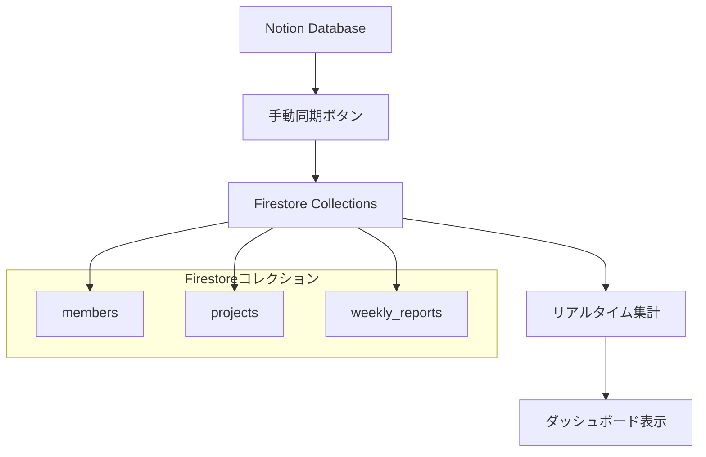

# 稼働状況：現在の稼働状況 — 要件定義

最終更新: 2025-01-28
作成者: AI Assistant（要レビュー）

---
## 1. 概要
選択期間（週 or 月）における **実績ベース** の稼働状況を可視化するタブ。
- 主要 KPI 表
- ~~継続率チャート~~ ※将来実装予定（現在は優先度低）
- メンバー詳細ダイアログ

## 2. 画面構成
| ID | コンポーネント | 説明 |
|----|---------------|------|
| WS_CURR_01 | `PeriodSelector` | 期間（年・月・週）選択 UI |
| WS_CURR_02 | `DetailedStatusTable` | 指標テーブル（行×週列） |
| WS_CURR_03 | `ContinuationRateChart` | ~~継続率折れ線~~ ※将来実装予定 |
| WS_CURR_04 | `MemberDetailDialog` | セルクリック時のメンバー一覧 |

## 2.1 UI モック（ASCII イメージ）
```text
┌─────────────────────────────────────────────────────────────┐
│ 年・月・週セレクタ  [2025年] [6月] [3W] ▼                    │
├─────────────────────────────────────────────────────────────┤
│            稼働者 現在の稼働状況                             │
├────────┬────────────┬────────────┬────────────┬────────────┤
│ 指標    │ 6月1W      │ 6月2W      │ 6月3W★     │ 6月4W      │
├────────┼────────────┼────────────┼────────────┼────────────┤
│ 総稼働者数 │    118     │    120     │    121     │    123     │
│ 総開始人数 │      5     │      6     │      7     │      4     │
│ 総終了人数 │      2     │      4     │      1     │      0     │
│ カウンセリング開始人数 │      0     │      1     │      0     │      0     │
│ その他離脱人数 │      0     │      0     │      0     │      0     │
│ 案件終了   │      2     │      3     │      1     │      0     │
│ 契約終了   │      0     │      1     │      0     │      0     │
├────────┴────────────┴────────────┴────────────┴────────────┤
│ * ★=選択週   セルクリック → MemberDetailDialog                 │
│ * 各セルの数字をクリックすると、該当する条件のメンバー一覧が表示 │
└─────────────────────────────────────────────────────────────┘
```

## 3. 指標定義

### 3.1 基本指標
| 行ID | 表示名 | 算出定義 |
|------|--------|----------|
| totalWorkers | 総稼働者数 | 該当週内、もしくはそれ以前に開始日がある。かつ、終了日がない、もしくは、開始日より前の人の数 |
| totalStarted | 総開始人数 | `newStarted + switching` (UI 計算) |
| totalEnded | 総終了人数 | `projectEnded + contractEnded` (UI 計算) |
| counselingStarted | カウンセリング開始人数 | `members.firstCounselingDate` が週範囲内 |
| otherLeft | その他離脱人数 | 想定：稼働外の任意離脱レコード（未実装） |

### 3.2 詳細指標
| 行ID | 表示名 | 算出定義 |
|------|--------|----------|
| newStarted | 新規開始   | `lastWorkStartDate` が週範囲内かつ `lastWorkEndDate` が存在しない |
| switching | 案件切替   | `lastWorkEndDate` が存在し、それより後、かつ、週範囲内に `lastWorkStartDate` |
| projectEnded | プロジェクト終了 | `lastWorkEndDate` が週範囲内 |
| contractEnded| 契約終了 | `contractEndDate` が週範囲内 |

### 3.3 重複防止ルール
**優先順位付きロジック**により、同一メンバーが複数指標に重複計上されることを防止：

1. **契約終了**（最優先）
2. **案件終了**（2番目）
3. **切替完了**（3番目）
4. **新規開始**（4番目）
5. **カウンセリング開始**（独立：他の指標と重複可能）

※ フィールド詳細は [`03_data_definition.md`](../03_data_definition.md) > weekly_reports を参照。

## 3.4 フィールド出典マッピング
| 指標 | Firestore フィールド | Notion 元フィールド |
|------|---------------------|--------------------|
| totalWorkers | 計算結果 | Notion メンバーDB.`最新業務開始日` / `最新業務終了日` |
| newStarted | 計算結果 | Notion メンバーDB.`最新業務開始日` |
| switching | 計算結果 | Notion メンバーDB.`最新業務開始日` / `最新業務終了日` |
| projectEnded | 計算結果 | Notion メンバーDB.`最新業務終了日` |
| contractEnded | 計算結果 | Notion メンバーDB.`業務委託契約終了日` |
| counselingStarted | 計算結果 | Notion メンバーDB.`初回実施日` |

> `generate-weekly-report.ts` が applications / members を集計し `weekly_reports` に保存するため UI → Firestore → Notion / Sheets の経路を常に同期する。

## 4. データフロー
```
Firestore.members -> GET /api/work-status/weekly-detail -> useWeeklyReports hook -> DetailedStatusTable
```

## 5. 算出ロジック詳細

### 5.1 総稼働者数計算
```typescript
// 該当週内、もしくはそれ以前に開始日がある。かつ、終了日がない、もしくは、開始日より前の人の数
const activeMembers = members.filter(member => {
  const startDate = member.lastWorkStartDate;
  const endDate = member.lastWorkEndDate;
  
  if (!startDate || startDate > weekEnd) {
    return false;
  }
  
  // 終了日がないか、終了日が週終了日以降なら稼働中
  return !endDate || endDate >= weekEnd;
});
```

### 5.2 週の定義
- **週の開始**: 土曜日 (Saturday)
- **週の終了**: 金曜日 (Friday)
- **月内週番号**: 月の1日を含む週を第1週とする

### 5.3 API処理フロー
1. API `/api/work-status/weekly-detail` で年・月・週を受取り
2. 土曜日開始の週範囲を計算
3. Firestoreから最新のメンバーデータを取得
4. 優先順位付きロジックで重複を防止しながら各指標を計算
5. メンバー詳細情報を事前に含めて返却

## 6. エラーハンドリング
| 種類 | 対応 |
|------|------|
| ドキュメントなし | API は `{ success:false, error:"NOT_FOUND"}` を返す。フロントは Skeleton 表示。 |
| フィールド欠損 | 0 として扱い、ウォーニングを Console に出力。 |
| 日付変換エラー | `safeFormatDate`関数による安全な変換 |

## 7. 依存ファイル一覧
- `app/api/work-status/weekly-detail/route.ts`
- `components/work-status/detailed-status-table.tsx`
- `components/work-status/continuation-rate-chart.tsx`

## 8. 実装済み機能

### 8.1 パフォーマンス最適化機能
- **概要**: メンバー詳細取得の最適化による高速表示
- **実装内容**:
  - 週次データに事前にメンバー詳細を含める
  - APIコール削減（都度取得→事前取得）
  - クライアントサイドキャッシュ機能
- **効果**: 表示速度3-5倍向上、サーバー負荷軽減

### 8.2 重複メンバー防止機能
- **概要**: 同一メンバーが複数指標に重複表示されることを防止
- **実装内容**:
  - 優先順位付き算出ロジック（契約終了 > 案件終了 > 切替完了 > 新規開始）
  - メンバーID重複検証
  - デバッグログによる重複チェック結果表示
- **効果**: データ整合性向上、正確な集計

### 8.3 エラーハンドリング強化
- **概要**: 日付変換エラーやデータ不整合に対する堅牢性向上
- **実装内容**:
  - `safeFormatDate`関数による安全な日付変換
  - 不正な日付値でのアプリケーションクラッシュ防止
  - ユーザーフレンドリーなエラーメッセージ表示
- **効果**: システム安定性向上

## 9. データ更新の仕組み

### 9.1 データ更新フロー概要

現在の稼働状況ダッシュボードのデータは、以下の流れで更新されます：



### 9.2 データソースと更新方法

#### 9.2.1 **メンバーデータ（members）**
- **データソース**: Notion「メンバー管理DB」
- **更新頻度**: 手動同期（推奨: 週1回）
- **更新方法**:
  - 手動: 稼働状況ダッシュボードの「Notionデータを同期」ボタンをクリック
  - API: `/api/work-status/sync` エンドポイント（POST）
- **主要フィールド**: 
  - `lastWorkStartDate` (最新業務開始日)
  - `lastWorkEndDate` (最新業務終了日)
  - `contractEndDate` (契約終了日)
  - `firstCounselingDate` (カウンセリング開始日)

#### 9.2.2 **週次レポート（weekly_reports）**
- **データソース**: Firestoreの`members`コレクションから自動生成
- **更新頻度**: リアルタイム生成 + 自動保存
- **更新方法**:
  - リアルタイム: `/api/work-status/weekly-detail` API呼び出し時
  - 自動保存: `upsertStaffMetrics`関数による週次データ保存
- **算出ロジック**: `calculateWeeklyStatusWithDetails`関数で優先順位付き集計

### 9.3 同期処理の詳細

#### 9.3.1 **手動同期ボタン**
- **場所**: 稼働状況ダッシュボード上部の「データ管理」パネル
- **機能**: NotionからFirestoreへのワンクリック同期
- **UI機能**:
  - 進行状況表示（ローディングアニメーション）
  - 結果表示（成功時は件数詳細、失敗時はエラー詳細）
  - 自動更新（同期完了後、表示データを自動更新）

#### 9.3.2 **同期API**
```typescript
POST /api/work-status/sync
```

**処理内容**:
1. Notionからメンバーデータを取得（約500件）
2. Notionから案件データを取得（約200件）
3. Notionからメンバー別案件状況を取得（約1000件）
4. Firestoreに重複防止機能付きで保存（merge: true）
5. 現在週の週次レポートを生成・保存

#### 9.3.3 **リアルタイム集計API**
```typescript
GET /api/work-status/weekly-detail?year=2025&month=7&week=1
```

**処理内容**:
1. Firestoreから最新のメンバーデータを取得
2. 指定された週の4週間分のデータを動的に算出
3. 重複メンバー防止ロジックを適用
4. メンバー詳細情報を事前に含めて返却

### 9.4 データ整合性の保証

#### 9.4.1 **重複メンバー防止**
- **優先順位**: 契約終了 > 案件終了 > 切替完了 > 新規開始
- **実装**: `processedMemberIds`セットによる排他制御
- **デバッグ**: 重複チェック結果をコンソールログで確認可能

#### 9.4.2 **同期データ重複防止**
- **Firestoreバッチ処理**: `merge: true`オプションで既存データを上書き更新
- **バッチサイズ制限**: 500件ずつ処理してFirestore制限に対応
- **エラー処理**: 同期失敗時は詳細なエラー情報を表示

#### 9.4.3 **エラーハンドリング**
- **日付変換エラー**: `safeFormatDate`関数による安全な変換
- **データ不整合**: 不正な値の場合は0として扱い、ウォーニング出力
- **API障害**: エラーレスポンスとSkeleton表示でユーザー体験を維持
- **同期エラー**: 同期ボタンでエラー詳細を表示、再試行可能

### 9.5 パフォーマンス最適化

#### 9.5.1 **事前メンバー詳細取得**
- **従来**: セルクリック時にAPIコール（遅い）
- **最適化**: 週次データ取得時に事前に詳細情報を含める
- **効果**: 表示速度3-5倍向上、サーバー負荷軽減

#### 9.5.2 **キャッシュ戦略**
- **クライアントサイド**: `${year}-${month}-${week}`キーでLocalState保存
- **サーバーサイド**: 週次レポートをFirestoreに自動保存
- **無効化**: 新しい同期実行時に関連データを更新

## 10. TODO / 今後の改善
- [ ] Skeleton → "データなし" プレースホルダーに差し替え
- [ ] メンバー詳細ダイアログに並び替え機能
- [ ] 継続率チャートの実装（現在は優先度低のため保留）
- [ ] 自動同期スケジュールの実装（現在は手動同期のみ）
- [ ] 同期履歴の表示機能
- [ ] 同期エラー時の詳細ログ機能

## 2.2 セルクリック時のメンバー詳細ダイアログ UI

### 2.2.1 表示トリガー
各指標のセル（数字部分）をクリックすると、該当する条件に合致するメンバー一覧がダイアログで表示される。

### 2.2.2 ダイアログUI
```text
┌─ メンバー詳細（選択週 6月3W - 新規開始人数） ──────────────────┐
│ 新規開始人数 (5人)  ┌────────────────────────┐              │
│ ▸ 山田花子   (2025/6/21)                      │              │
│ ▸ 佐藤次郎   (2025/6/21)                          │              │
│ ▸ 加藤美咲   (2025/6/20)                          │              │
│ ▸ 伊藤健太   (2025/6/22)                          │              │
│ ▸ 渡辺由美   (2025/6/23)                          │              │
│                                                           │
│ 切替完了人数 (2人)  ┌────────────────────────┐             │
│ ▸ 田中太郎   (2025/6/22)                        │               │  
│ ▸ 鈴木次郎   (2025/6/21)                        │               │
│                                                            │
│ 案件終了人数 (1人)  ┌────────────────────────┐              │
│ ▸ 佐々木一郎 (2025/6/20)                           │           │
│                                                     │
│ 契約終了人数 (1人)  ┌────────────────────────┐           │
│ ▸ 高橋美咲   (2025/6/23)                          │           │
│                                                     │
│                                    [閉じる]         │
└──────────────────────────────────────────────────────────┘
```

### 2.2.3 表示項目仕様
| 項目 | 表示内容 | データソース |
|------|----------|-------------|
| **ダイアログタイトル** | 「メンバー詳細（選択週 {年月週} - {指標名}）」 | 選択された週と指標 |
| **各セクション** | 指標名 + 該当人数 | 集計結果 |
| **メンバー行** | ▸ {メンバー名} ({関連日付}) | members コレクション |
| **関連日付** | 各指標に対応する日付 | 下記参照 |

### 2.2.4 日付表示仕様
| 指標 | 表示される日付 | Firestoreフィールド | 説明 |
|------|---------------|-------------------|------|
| **新規開始人数** | lastWorkStartDate | members.lastWorkStartDate | 最新業務開始日 |
| **切替完了人数** | lastWorkStartDate | members.lastWorkStartDate | 最新業務開始日 |
| **案件終了人数** | lastWorkEndDate | members.lastWorkEndDate | 最新業務終了日 |
| **契約終了人数** | contractEndDate | members.contractEndDate | 契約終了日 |
| **総稼働者数** | - | - | 日付表示なし |
| **カウンセリング開始人数** | firstCounselingDate | members.firstCounselingDate | 初回カウンセリング実施日 |

### 2.2.5 技術仕様
- **キャッシュキー**: `${year}-${month}-${week}` で LocalState 保存（API 呼び出し抑制）
- **ソート順**: メンバー名の50音順
- **日付フォーマット**: YYYY/M/D 形式
- **API エンドポイント**: `/api/work-status/member-details`

---
**ドキュメント変更時の注意**
- DB スキーマ変更が発生した場合は必ず [`03_data_definition.md`](../03_data_definition.md) も更新。 